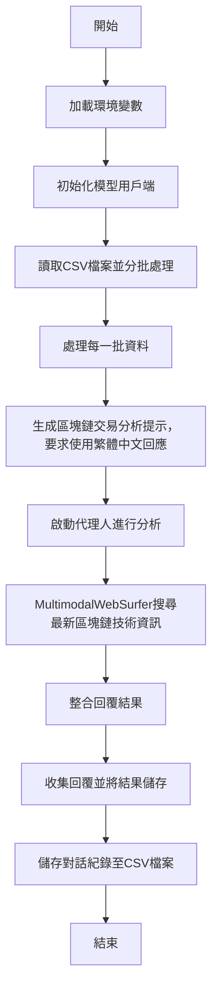

根據您的要求，我將幫您畫出一個流程圖，來描述這段程式碼的工作流程。

以下是流程圖的步驟，描述了如何處理每一批區塊鏈交易資料並生成對話記錄：

### 流程圖說明：
1. **開始**：程式啟動後，會加載所需的環境變數。
2. **初始化模型用戶端**：根據 API 密鑰初始化模型。
3. **讀取CSV檔案並分批處理**：程式會從 CSV 檔案中讀取區塊鏈交易資料並按批次進行處理。
4. **處理每一批資料**：將每一批資料轉換為 `dict` 格式，並生成分析提示。
5. **生成區塊鏈交易分析提示**：為每一批資料創建分析提示，並要求代理人使用繁體中文回應。
6. **啟動代理人進行分析**：啟動代理人，並開始處理分析任務。
7. **MultimodalWebSurfer搜尋最新區塊鏈技術資訊**：搜尋外部網站以獲得最新區塊鏈技術和交易安全建議。
8. **整合回覆結果**：將搜尋結果與代理人回覆整合，提供完整的建議。
9. **收集回覆並將結果儲存**：收集所有代理人回覆並整理成對話紀錄。
10. **儲存對話紀錄至CSV檔案**：將最終的對話紀錄儲存為 CSV 檔案。
11. **結束**：程式完成對所有資料的處理。

這個流程圖能夠清楚地顯示出每個主要步驟如何協作來處理區塊鏈交易資料，並生成最終的分析結果。如果您需要任何進一步的修改或解釋，隨時告訴我！